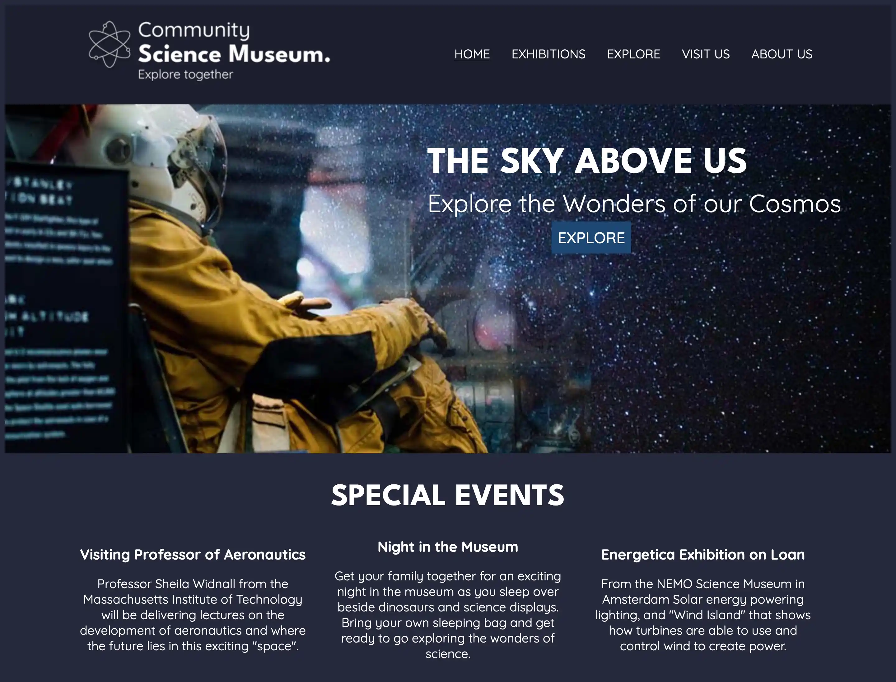

# Community Science Museum - Semester Project 1 



A website for an interactive science museum called Community Science Museum. 

## Description

The site is developed with HTML and CSS for the Community Science Museum, targeting middle school children, at the age of 7-15, and their parents. The design draws inspiration from the museum's cosmology exhibition.

## Built With

- HTML
- CSS

## Getting Started

### Installing

1. Clone the repo:

```bash
git clone git@github.com/aa096/Semester-Project-1.git
```

2. Install the dependencies:

```
npm install
```

### Running

Here is where you detail how to run the app. It typically involves the commands you'd need to run to start the project e.g.

To run the app, run the following commands:

```bash
npm run start
```

## Contact
- Email: aashild.rasmussen@gmail.com
- LinkedIn: [Aashild L. Rasmussen](www.linkedin.com/in/aashild-lauvland-rasmussen-8494a91ba)
- Portofolio: https://aashild-rasmussen.netlify.app/